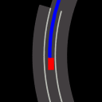
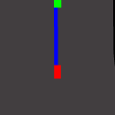
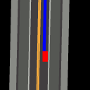

# 🌍 Learn to Drive in "Dreams": CarDreamer 🚗

Unleash the power of **imagination** and **generalization** of world models for self-driving cars

## **Can world models imagine traffic dynamics for training autonomous driving agents? The answer is YES!**

Integrating the high-fidelity CARLA simulator with world models, we are able to train a world model that not only learns complex environment dynamics but also have an agent interact with the neural network "simulator" to learn to drive.

Simply put, in CarDreamer the agent can learn to drive in a "dream world" from scratch, mastering maneuvers like overtaking and right turns, and avoiding collisions in heavy traffic—all within an imagined world!

Dive into our demos to see the agent skillfully navigating challenges and ensuring safe and efficient travel.

## 📚 Open-Source World Model-Based Autonomous Driving Platform

**Explore** world model based autonomous driving with CarDreamer, an open-source platform designed for the **development** and **evaluation** of **world model** based autonomous driving.

* 🏙️ **Built-in Urban Driving Tasks**: flexible and customizable observation modality and observability; optimized rewards
* 🔧 **Task Development Suite**: create your own urban driving tasks with ease
* 🌍 **Model Backbones**: integrated state-of-the-art world models

**Documentation:** [CarDreamer API Documents](https://car-dreamer.readthedocs.io/en/latest/).

**Looking for more techincal details? Check our report here! [Paper link](https://arxiv.org/abs/2405.09111)**


## :sun_with_face: Built-in Task Demos

> [!TIP]
> A world model is learnt to model traffic dynamics; then a driving agent is trained on world model's imagination! The driving agent masters diverse driving skills including lane merge, left turn, and right turn, to random roadming purely **from scratch**.

We train DreamerV3 agents on our built-in tasks with a single 4090. Depending on the observation spaces, the memory overhead ranges from 10GB-20GB alongwith 3GB reserved for CARLA.

| Right turn hard | Roundabout | Left turn hard | Lane merge | Overtake |
| :-------------: | :--------: | :------------: | :--------: | :------: |
|  |  |  |  |  |

| Right turn hard | Roundabout | Left turn hard | Lane merge | Right turn simple |
| :-------------: | :--------: | :------------: | :--------: | :---------------: |
|  |  |  |  |  |


## :blossom: The Power of Intention Sharing

> [!TIP]
> **Human drivers use turn signals to inform their intentions** of turning left or right. **Autonomous vehicles can do the same!**

Let's see how CarDreamer agents communicate and leverage intentions. Our experiment have demonstrated that through sharing intention, the policy learning is much easier! Specifically, a policy without knowing other agents' intentions can be conservative in our crossroad tasks; while intention sharing allows the agents to find the proper timing to cut in the traffic flow.


<!-- Table 1: Sharing waypoints vs. Without sharing waypoints -->
| Sharing waypoints vs. Without sharing waypoints | Sharing waypoints vs. Without sharing waypoints |
| :---------------------------------------------: | :---------------------------------------------: |
| **Right turn hard**                                  | **Left turn hard**                                  |
|  &emsp;&emsp;&emsp;  |  &emsp;&emsp;&emsp; |

<!-- Table 2: Full observability vs. Partial observability -->
| Full observability vs. Partial observability |
| :------------------------------------------: |
| **Right turn hard**                               |
|  &emsp;&emsp;&emsp;  |


## 📋 Prerequisites

Clone the repository:

```bash
git clone https://github.com/ucd-dare/CarDreamer
cd CarDreamer
```

Download [CARLA release](https://github.com/carla-simulator/carla/releases) of version ``0.9.15`` as we experiemented with this version. Set the following environment variables:

```bash
export CARLA_ROOT="</path/to/carla>"
export PYTHONPATH="${CARLA_ROOT}/PythonAPI/carla":${PYTHONPATH}
```

Install the package using flit. The ``--symlink`` flag is used to create a symlink to the package in the Python environment, so that changes to the package are immediately available without reinstallation. (``--pth-file`` also works, as an alternative to ``--symlink``.)

```bash
conda create python=3.10 --name cardreamer
conda activate cardreamer
pip install flit
flit install --symlink
```

## :gear: Creating Tasks

Check out built-in tasks at [CarDreamer Docs: Tasks and Confiugrations](https://car-dreamer.readthedocs.io/en/latest/tasks.html).

```python
# To create the gym environment with default task configurations
import car_dreamer
task, task_configs = car_dreamer.create_task('carla_four_lane')

# Or only load default environment configurations without instantiation
task_configs = car_dreamer.load_task_configs('carla_right_turn_hard')
```

To create your own driving tasks using the development suite, see [CarDreamer Docs: Customization](https://car-dreamer.readthedocs.io/en/latest/customization.html).

## :mechanical_arm: Training

Find ``README.md`` in the corresponding directory of the algorithm you want to use and follow the instructions.

## :computer: Visualization Tool

We stream observations, rewards, terminal conditions, and custom metrics to a web browser for each training session in real-time, making it easier to engineer rewards and debug.

<table style="margin-left: auto; margin-right: auto;">
  <tr>
    <td class="center-text">Visualization Server</td>
  </tr>
  <tr>
    <td></td>
  </tr>
</table>

## :hammer: System

To easily customize your own driving tasks, and observation spaces, etc., please refer to our [CarDreamer API Documents](https://car-dreamer.readthedocs.io/en/latest/).


# :star2: Citation

If you find this repository useful, please cite this paper:

**[Paper link](https://arxiv.org/abs/2405.09111)**
```
@article{CarDreamer2024,
  title = {{CarDreamer: Open-Source Learning Platform for World Model based Autonomous Driving}},
  author = {Dechen Gao, Shuangyu Cai, Hanchu Zhou, Hang Wang, Iman Soltani, Junshan Zhang},
  journal = {arXiv preprint arXiv:2405.09111},
  year = {2024},
  month = {May}
}
```


# Suppliment Material
## World model imagination
<p align="center">
  Birdeye view training
</p>

<p align="center">
  Camera view training
</p>

<p align="center">
  LiDAR view training
</p>


# 👥 Contributors

### Credits

`CarDreamer` builds on the several projects within the autonomous driving and machine learning communities.

- [gym-carla](https://github.com/cjy1992/gym-carla)
- [DreamerV2](https://github.com/danijar/director)
- [DreamerV3](https://github.com/danijar/dreamerv3)
- [CuriousReplay](https://github.com/AutonomousAgentsLab/curiousreplay)

<!-- readme: contributors -start -->
<table>
	<tbody>
		<tr>
            <td align="center">
                <a href="https://github.com/tonycaisy">
                    
                    <br />
                    <sub><b>Shuangyu Cai</b></sub>
                </a>
            </td>
            <td align="center">
                <a href="https://github.com/gaodechen">
                    
                    <br />
                    <sub><b>GaoDechen</b></sub>
                </a>
            </td>
            <td align="center">
                <a href="https://github.com/HanchuZhou">
                    
                    <br />
                    <sub><b>Hanchu Zhou</b></sub>
                </a>
            </td>
            <td align="center">
                <a href="https://github.com/junshanzhangJZ2080">
                    
                    <br />
                    <sub><b>junshanzhangJZ2080</b></sub>
                </a>
            </td>
            <td align="center">
                <a href="https://github.com/ustcmike">
                    
                    <br />
                    <sub><b>ucdmike</b></sub>
                </a>
            </td>
		</tr>
	<tbody>
</table>
<!-- readme: contributors -end -->
